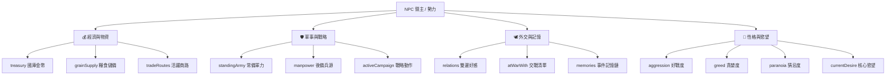

# NPC 自主推演與動態世界觀系統設計規範 (NPC Autonomous System Design)

## 1. 系統核心願景與定位 (Core Vision)
- **服務於劇情世界觀的活態載體**：雕琢 NPC 自主運算與地緣政治玩法的核心目的，是**為遊戲的劇情、世界觀與文學描寫提供源源不絕的戲劇張力與臨場感**。
- **拒絕無靈魂的死板罐頭**：NPC 不再是隨機跳數字的冷冰冰木偶，而是具有真實「慾望、經濟壓力、性格偏執、外交記憶與生存本能」的封建領主與勢力，在大地圖上展開有來有回的爾虞我詐。

---

## 2. 前期已完成之系統基石 (Completed Foundations)

### 2.1 據點規模與圖標機制解耦
- **拔除 NPC 繁榮度衰退與強制降級**：各大國家首都、軍事要塞與野外險地永久鎖定其設定的原始規模等級（`nodeLevel`），跑商特產、街道設施與攻城關卡全面穩定。
- **保留玩家領地晉升成就感**：僅玩家主據點（`node.isPlayerBase`）隨人口、建築與道路繁榮度動態評分升級。
- **大地圖 `customIcon` 動態 Sprite 切格渲染引擎接通**：
  - Phaser 大地圖引擎全面支援直接讀取 `node.customIcon` 並依據圖集（如 `cave_node_01`、`settlement_sheet`）進行像素級精確動態切格渲染。
  - 玩家據點外觀升級階梯已綁定專屬 2.5D Isometric 圖標（營地 #0 ➔ 村莊 #5 ➔ 城鎮 #10 ➔ 首都 #20 / 荒野保持原圖）。

---

## 3. 故事工坊與 NPC 自主推演「防衝突共存架構」 (Narrative-Sandbox Coexistence)

為了解決「創作者精心編織的確定性劇情」與「沙盒 NPC 自主推演的隨機性」之間的潛在矛盾，建立以下標準合約：

### 3.1 三大可枚舉之沙盒狀態合約 (Finite State Contract)
底層自主演算法不管運算得多複雜，對世界城鎮與領袖的影響**嚴格收斂為 3 個在故事工坊一目了然的標準狀態**：
1. **城鎮控制權 (Owner State)**：`ORIGINAL` (原國統治) / `ENEMY_OCCUPIED` (敵國佔領) / `PLAYER_CONTROLLED` (玩家佔領)。
2. **戰爭與圍城 (War State)**：`PEACE` (和平常態) / `SIEGED` (正在被圍城) / `DEVASTATED` (戰後破敗)。
3. **領袖政治處境 (Leader State)**：`ACTIVE` (在位掌權) / `CAPTIVE_OR_EXILED` (落魄流亡/囚徒) / `AT_WAR` (交戰宿敵)。

### 3.2 故事工坊雙軌調用機制
- **自適應分支 (Branching)**：創作者可根據城鎮或領袖的狀態拉出 2~3 個精準的劇情分支（如：赫斯特掌權時的「盛大加冕」vs 被北境佔領時的「傀儡受降」）。
- **動態文字插值 (Text Interpolation)**：文本支援 `{NODE_OCCUPIER}`、`{WAR_ATMOSPHERE}` 等變數標籤，系統自動根據當前世界狀態代入小說級臨場語句，免除繁瑣窮舉。
- **劇情主線保護鎖 (Plot Armor Lock)**：關鍵主線 NPC 或城鎮在指定劇情章節觸發前，享有「免死/不可滅亡」保護，直到劇情節點正式解鎖全面戰亂。

---

## 4. NPC 底層「四大維度變數體系」 (Underlying Variable Matrix)



1. **💰 經濟與物資 (`Economic Profile`)**：
   - `treasury`（國庫金幣）：直接影響招兵、發餉、發布僱傭委託與求援能力。
   - `grainSupply`（糧食天數）：斷糧時城防戰力每天下降 20%，逼發掠奪戰爭。
2. **🛡️ 軍事與戰略 (`Military Profile`)**：
   - `standingArmy`（常備軍編制：步兵、弓兵、騎兵）。
   - `manpower`（後備兵源）：戰死兵力隨時間招募補充，避免無限憑空暴兵。
   - `activeCampaign`（當前戰略行動：行軍坐標、圍城倒數、戰略意圖）。
3. **🕊️ 外交與事件記憶 (`Diplomacy & Memory Ledger`)**：
   - `relations`（雙邊好感 -100 ~ +100）。
   - `memories`（時效性事件記錄，如「被劫商隊」、「馳援解圍」、「斬殺死敵」）。
4. **🧠 領主性格特質 (`Personality Traits`)**：
   - `aggression`（好戰侵略度 0~100）、`greed`（貪婪度 0~100）、`paranoia`（猜忌多疑度 0~100）、`honor`（信誓榮譽度 0~100）。
   - `currentDesire`（當前核心慾望：`EXPAND` 擴張 / `PROSPER` 富足 / `AVENGE` 復仇 / `SURVIVE` 求生）。

---

## 5. NPC 防崩潰「四大保命煞車機制」 (Anti-Collapse Circuit Breakers)

防止好戰領主（如沃爾蒙德大公）因盲目宣戰而把自己迅速玩到國庫破產滅亡的自我調節系統：

1. **🛑 國防底線儲備**：老巢永久鎖定至少 **35% 親衛守軍**；國庫跌破 `1,500 金幣`（僅夠發 2 個月軍餉）時強制凍結主動進攻，轉入警戒防守。
2. **🕊️ 戰損妥協求和**：前線部隊損失超過 **40%** 或財政崩潰時，性格強制切換為 `SURVIVE`，主動割讓外圍小村或賠款簽訂停戰協議，獲取 **180 天停戰保護期**。
3. **🌾 厭戰度與農忙休養週期 (`War Weariness`)**：大戰結束後強制進入 **60~90 天休養生息**，動員兵回田收割小麥、整補軍備、恢復後備兵力。
4. **🦹 危機向外轉嫁**：沒錢發軍餉時，向附庸村落徵收特別戰爭稅，或向玩家發布黑市髒活（劫掠商隊分紅）渡過難關。

---

## 6. 化死板為靈動的「三大連續劇式表現層」 (Living Dramatic Presentation)

```
[底層數值推演] ➔ 轉譯 ➔ [可見行軍 / 酒館傳聞 / 沾血密信] ➔ 引發 ➔ [連續因果事件鏈]
```

1. **🔗 連續因果事件鏈 (`Event Arcs`)**：
   - 事件絕非單點隨機抽取，而是具備**前因後果的連續劇**：
     - *第 10 天（導火線）：邊境商隊遭劫 ➔ 第 18 天（衝突升級）：受害國發動全境經濟制裁 ➔ 第 25 天（高潮爆發）：缺鹽大公親率大軍發起要塞圍城戰！*
2. **🎭 五大陣營專屬語氣黑話庫 (`Faction Tone Matrix`)**：
   - 拒絕統一客服語氣，各國文本採用專屬文風（北境粗獷戰斧語氣、東境拉丁經文宗教語氣、南境奢華毒藥商人辭令）。
3. **🌪️ 傭兵介入改變歷史走向 (`Player Pivot`)**：
   - 兩國交戰觸發「高額競標戰（Bidding War）」：玩家可選擇收錢助攻、受雇解圍、甚至兩頭收錢臨陣倒戈，徹底改寫大陸歷史。

---

## 7. 階段性實裝路線圖 (Implementation Roadmap)

- [x] **階段 0**：拔除 NPC 繁榮度衰退、接通大地圖 `customIcon` 動態切圖渲染引擎、綁定玩家據點 2.5D 圖標。
- [ ] **階段 1 (核心數據與經濟)**：建立 `FactionEconomyEngine`，實裝國庫、軍餉、糧食消耗與兵力補充。
- [ ] **階段 2 (決策 AI 與保命煞車)**：建立 `FactionDecisionAI`，實裝領主性格評估、目標選取與 4 大保命煞車機制。
- [ ] **階段 3 (大地圖可見戰役與行軍)**：建立 `FactionCampaignSystem`，實裝大地圖道路軍團行軍、圍城倒數、戰鬥結算與酒館連續劇傳聞播報。
- [ ] **階段 4 (故事工坊自適應插值支援)**：在故事編輯器中擴充讀取三大沙盒狀態（控制權/戰況/領袖狀態）之條件選單與動態文本標籤。
